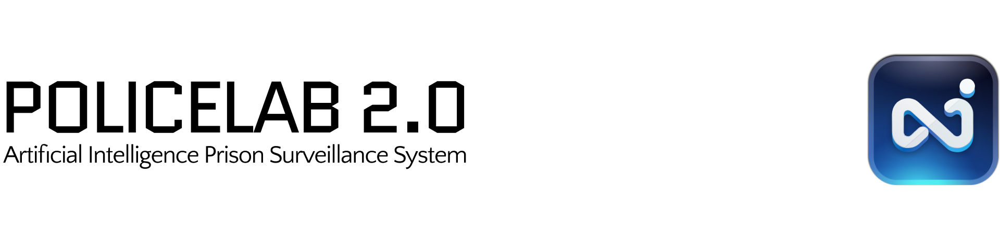
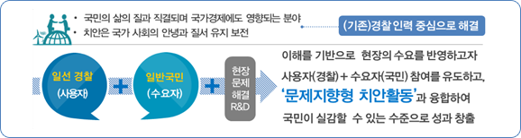

# 소개

이 저장소는 동국대학교 대학원에서 개발한 치안현장 맞춤형 연구개발사업(폴리스랩 2.0)을 위해 개발된 인공지능 모델 통합 시스템의 대시보드입니다.

### 폴리스랩 2.0이란?

-   국민, 경찰, 연구자 등이 협업하여 치안 현장에서 발생하는 문제를 발굴하고 첨단과학기술과 ICT융합을 통해 문제해결 및 실증
-   연구자와 사용자(경찰)간 상호작용을 촉진하기 위해 실제 환경에서 기술개발이 가능한 실증 실험실(폴리스랩\*) 구축

*   > 치안을 뜻하는 폴리스(Police)와 리빙랩(Living-Lab)의 합성어

-   치안 현장의 문제해결을 위해 실제 적용 및 검증할 수 있도록 현장에서 실증연구를 강화하여 완결성 제고

    

## 주요기능

### 1. 유치실 멀티뷰

-   **유치실 모니터링** : 실시간 유치실 영상을 시각화합니다.
-   **유치실 이벤트** : 유치실에서 발생한 이벤트를 시각화합니다.

### 2. 유치실 오버뷰

-   **유치인 모니터링** : 유치실내 유치인의 실시간 스냅샷 및 감정(긍정, 부정1단계, 부정2단계), 체온(표면온도), 심박수, 호흡수를 시각화합니다. 단, 화장실 내 유치인에 대한 스냅샷은 제공되지 않습니다.

### 3. 이벤트 알람

-   **UI 알람** : 유치실 내에서 발생하는 이벤트에 대해 UI(아이콘 및 색상)으로 알람을 전달합니다. (\*On/Off 전환 불가)
-   **브라우저 알람** : 브라우저 비활성화 또는 최소화상태에서 OS 알림을 통해 알람을 전달합니다. (\*On/Off 전환 가능)
-   **TTS 알람** : 유치실 내에서 발생하는 이벤트에 대해 음성(TTS)을 통해 알람을 전달합니다. (\*On/Off 전환 가능)
    -   ex) 유치실 1에서 낙상 이벤트 발생 시, "유치실 1에서 낙상 발생" 음성이 3회 재생됨.

### 4. 이벤트 관리

-   **이벤트 조회** : 유치실 내에서 발생한 이벤트를 조회할 수 있습니다.
-   **이벤트 필터링** : 유치실 내에서 발생한 이벤트를 필터링하여 조회할 수 있습니다. 필터 항목은 아래와 같습니다.
    -   날짜 및 시간 : 시작일/시 및 종료일/시 안에 포함된 이벤트 조회 가능
    -   유치실 : 특정 유치실 조회 가능
    -   이벤트 유형 : 특정 이벤트 유형 조회 가능

### 5. CCTV 관리

-   **CCTV 등록** : 새로운 CCTV(엣지카메라)를 등록할 수 있습니다. 이 기능은 CCTV 유효성 검사를 포함합니다.
-   **CCTV 정보 조회** : 시스템에 등록된 CCTV 정보를 조회할 수 있습니다.
-   **CCTV 정보 수정** : 시스템에 등록된 CCTV 정보를 수정할 수 있습니다.
-   **CCTV 삭제** : 시스템에 등록된 CCTV를 삭제할 수 있습니다.

### 6. 유치실 관리

-   **유치실 등록** : 새로운 유치실를 등록할 수 있습니다.
-   **유치실 정보 조회** : 시스템에 등록된 유치실 정보를 조회할 수 있습니다.
-   **유치실 정보 수정** : 시스템에 등록된 유치실 정보를 수정할 수 있습니다.
-   **유치실 삭제** : 시스템에 등록된 유치실 삭제할 수 있습니다.

# 설치

### 1. 라이브러리 설치

```
npm install
```

웹 수정 및 실행을 위해 아래 라이브러리가 필요합니다.

package.json

```
...
"dependencies": {
        "@radix-ui/react-accordion": "^1.1.2",
        "@radix-ui/react-alert-dialog": "^1.0.5",
        "@radix-ui/react-avatar": "^1.0.4",
        "@radix-ui/react-dialog": "^1.0.5",
        "@radix-ui/react-dropdown-menu": "^2.0.6",
        "@radix-ui/react-label": "^2.0.2",
        "@radix-ui/react-popover": "^1.0.7",
        "@radix-ui/react-scroll-area": "^1.0.5",
        "@radix-ui/react-select": "^2.0.0",
        "@radix-ui/react-separator": "^1.0.3",
        "@radix-ui/react-slot": "^1.0.2",
        "@radix-ui/react-tabs": "^1.0.4",
        "@radix-ui/react-toggle": "^1.0.3",
        "@radix-ui/react-toggle-group": "^1.0.4",
        "@tanstack/react-table": "^8.12.0",
        "axios": "^1.6.7",
        "class-variance-authority": "^0.7.0",
        "clsx": "^2.1.0",
        "date-fns": "^3.6.0",
        "jsmpeg": "^1.0.0",
        "lucide-react": "^0.414.0",
        "node-rtsp-stream": "^0.0.9",
        "react": "^18.2.0",
        "react-aria": "^3.32.1",
        "react-cookies": "^0.1.1",
        "react-datepicker": "^7.3.0",
        "react-datetime-picker": "^6.0.1",
        "react-day-picker": "^8.10.0",
        "react-dom": "^18.2.0",
        "react-hook-form": "^7.52.1",
        "react-quill": "^2.0.0",
        "react-router-dom": "^6.22.1",
        "react-stately": "^3.30.1",
        "socket.io-client": "^4.7.4",
        "streamedian": "github:Streamedian/html5_rtsp_player",
        "tailwind-merge": "^2.2.1",
        "tailwindcss-animate": "^1.0.7",
        "vite-plugin-mkcert": "^1.17.5",
        "zustand": "^4.5.4"
    },
...
```

# 실행

### 개발모드로 실행

```
npm run dev
```

### 빌드

```
npm run build
```
